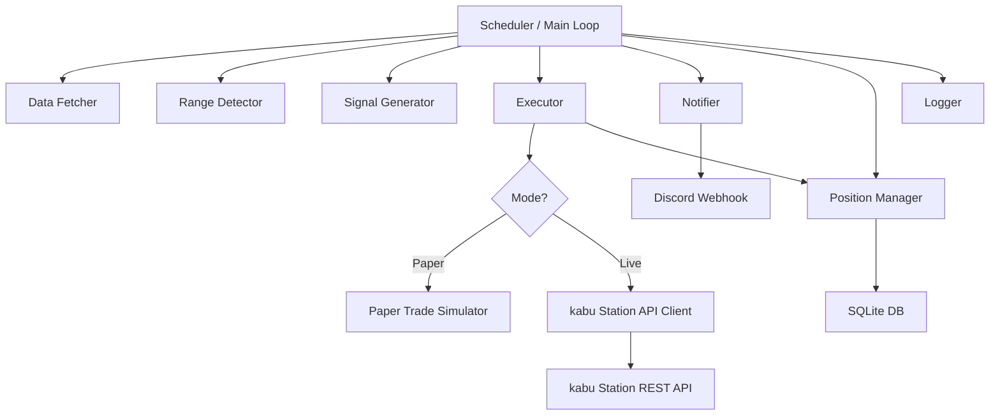

# Design Document

## Overview
日本株レンジ取引ボットのPhase 1-B設計書。kabu Station API を通じた売買執行エンジン、ペーパートレードシミュレーター、Discord通知、メインスケジューラーを追加する。Phase 1-A で実装済みの data_fetcher / range_detector / backtester / signal_generator と統合し、完全自動売買ループを実現する。

## Architecture
### High-Level Architecture


### System Components
| Component | Module | Description |
|-----------|--------|-------------|
| kabu API Client | `src/kabu_api.py` | kabu Station REST API のラッパー |
| Executor | `src/executor.py` | 売買執行エンジン（ペーパー/本番切替） |
| Paper Trader | `src/paper_trader.py` | ペーパートレードシミュレーター |
| Position Manager | `src/position_manager.py` | ポジション・残高管理（SQLite） |
| Notifier | `src/notifier.py` | Discord Webhook 通知 |
| Main | `src/main.py` | メインスケジューラー |

## Components and Interfaces

### Core Interfaces (Python dataclasses)

```python
@dataclass
class Order:
    symbol: str           # 銘柄コード（例: "9432"）
    side: str             # "buy" or "sell"
    order_type: str       # "limit"
    price: float          # 指値価格
    quantity: int          # 数量
    trade_type: str       # "spot" or "margin"
    order_id: str = ""    # API返却の注文ID
    status: str = "pending"  # pending/filled/cancelled/error
    created_at: str = ""
    filled_at: str = ""
    filled_price: float = 0.0

@dataclass
class Position:
    symbol: str
    side: str             # "long" or "short"
    quantity: int
    entry_price: float
    current_price: float = 0.0
    unrealized_pnl: float = 0.0
    opened_at: str = ""

@dataclass
class TradingSignal:
    symbol: str
    action: str           # "BUY", "SELL", "HOLD"
    price: float
    target_price: float
    stop_loss: float
    quantity: int
    reason: str

@dataclass
class DailyReport:
    date: str
    total_pnl: float
    realized_pnl: float
    unrealized_pnl: float
    positions: list
    trades_today: int
    balance: float
```

### kabu API Client (`src/kabu_api.py`)
**Responsibilities:**
- kabu Station API とのHTTP通信を管理
- トークン認証・自動更新
- レート制限の遵守

**Key Methods:**
- `authenticate(password: str) -> str` — トークン取得
- `get_board(symbol: str, exchange: int) -> dict` — 時価情報取得
- `place_order(order: Order) -> str` — 注文発注、注文IDを返す
- `cancel_order(order_id: str) -> bool` — 注文取消
- `get_orders() -> list[dict]` — 注文一覧取得
- `get_positions() -> list[dict]` — ポジション一覧取得

**API Base URL:**
- 本番: `http://localhost:18080/kabusapi`
- デモ: `http://localhost:18081/kabusapi`

**認証フロー:**
1. POST `/token` with `{"APIPassword": "<password>"}` → Token取得
2. 以降のリクエストヘッダに `X-API-KEY: <token>` を付与
3. トークンは取引開始時に1回取得、以降は同一トークンを使用

### Executor (`src/executor.py`)
**Responsibilities:**
- TradingSignal を受け取り、適切な注文を発行
- ペーパー/本番モードの切り替え
- 重複注文の防止
- リスク管理チェック

**Key Methods:**
- `execute_signal(signal: TradingSignal) -> Order` — シグナルに基づき注文執行
- `check_and_cancel_stale_orders(max_age_minutes: int)` — 古い未約定注文をキャンセル
- `sync_positions()` — API/シミュレーターからポジション同期

### Paper Trader (`src/paper_trader.py`)
**Responsibilities:**
- 仮想残高・仮想ポジション管理
- 注文のシミュレーション（指値注文は価格到達で約定扱い）
- 取引履歴のCSV出力

**Key Methods:**
- `place_order(order: Order) -> str` — 仮想注文、仮想注文IDを返す
- `check_fills(current_prices: dict)` — 価格到達で約定処理
- `get_positions() -> list[Position]`
- `get_balance() -> float`
- `export_history(filepath: str)` — CSV出力

### Position Manager (`src/position_manager.py`)
**Responsibilities:**
- SQLiteでポジション・注文履歴・残高を永続化
- リスク管理（最大ポジション数、最大投資金額）

**Key Methods:**
- `add_position(position: Position)`
- `close_position(symbol: str, close_price: float)`
- `get_open_positions() -> list[Position]`
- `can_open_new_position(amount: float) -> bool` — リスクチェック
- `get_daily_pnl() -> float`
- `save_order(order: Order)`

### Notifier (`src/notifier.py`)
**Responsibilities:**
- Discord Webhook でリアルタイム通知
- 日次レポート生成・送信

**Key Methods:**
- `notify_signal(signal: TradingSignal)` — シグナル通知
- `notify_fill(order: Order)` — 約定通知
- `notify_error(error: str)` — エラー通知
- `send_daily_report(report: DailyReport)` — 日次レポート

### Main (`src/main.py`)
**Responsibilities:**
- 取引時間管理（前場・後場・昼休み）
- メインループ（5分間隔）
- グレースフルシャットダウン

**Key Methods:**
- `run()` — メインエントリーポイント
- `trading_loop()` — 1サイクルの処理
- `pre_market_check()` — 取引前ヘルスチェック
- `post_market_report()` — 取引後レポート

## Data Models

### Database Schema (SQLite)

```sql
CREATE TABLE IF NOT EXISTS positions (
    id INTEGER PRIMARY KEY AUTOINCREMENT,
    symbol TEXT NOT NULL,
    side TEXT NOT NULL,
    quantity INTEGER NOT NULL,
    entry_price REAL NOT NULL,
    close_price REAL,
    pnl REAL,
    status TEXT DEFAULT 'open',
    opened_at TEXT NOT NULL,
    closed_at TEXT,
    created_at TEXT DEFAULT CURRENT_TIMESTAMP
);

CREATE TABLE IF NOT EXISTS orders (
    id INTEGER PRIMARY KEY AUTOINCREMENT,
    order_id TEXT UNIQUE,
    symbol TEXT NOT NULL,
    side TEXT NOT NULL,
    order_type TEXT NOT NULL,
    price REAL NOT NULL,
    quantity INTEGER NOT NULL,
    status TEXT DEFAULT 'pending',
    filled_price REAL,
    created_at TEXT DEFAULT CURRENT_TIMESTAMP,
    updated_at TEXT
);

CREATE TABLE IF NOT EXISTS daily_reports (
    id INTEGER PRIMARY KEY AUTOINCREMENT,
    date TEXT UNIQUE NOT NULL,
    total_pnl REAL,
    realized_pnl REAL,
    unrealized_pnl REAL,
    balance REAL,
    trades_count INTEGER,
    created_at TEXT DEFAULT CURRENT_TIMESTAMP
);
```

### File Storage Structure
```
data/
  trading.db          # SQLite database
  paper_trades.csv    # ペーパートレード履歴
  logs/
    trading_YYYYMMDD.log
```

## Error Handling
| Error Type | Strategy | Notification |
|-----------|----------|-------------|
| API通信エラー | 3回リトライ（指数バックオフ: 1s, 2s, 4s） | リトライ失敗時にDiscord通知 |
| 認証エラー | 再認証を試行、失敗時はボット停止 | 即座にDiscord通知 |
| 残高不足 | 注文をスキップ | Discord通知 |
| 注文エラー | ログに記録、次のサイクルで再試行 | Discord通知 |
| データ取得エラー | キャッシュデータを使用 | WARNING ログ |
| 個別銘柄エラー | その銘柄をスキップ、他は継続 | ログ記録 |

## Testing Strategy
| Test Type | Target | Tool |
|-----------|--------|------|
| 単体テスト | kabu_api（モック）、executor、paper_trader、position_manager、notifier | pytest + unittest.mock |
| 結合テスト | メインループの1サイクル（ペーパーモード） | pytest |
| E2Eテスト | ペーパートレード24時間稼働テスト | 手動 |
